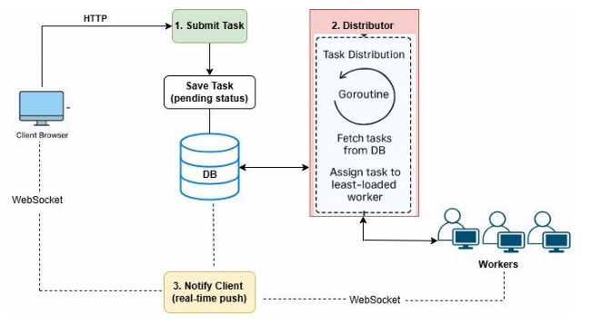
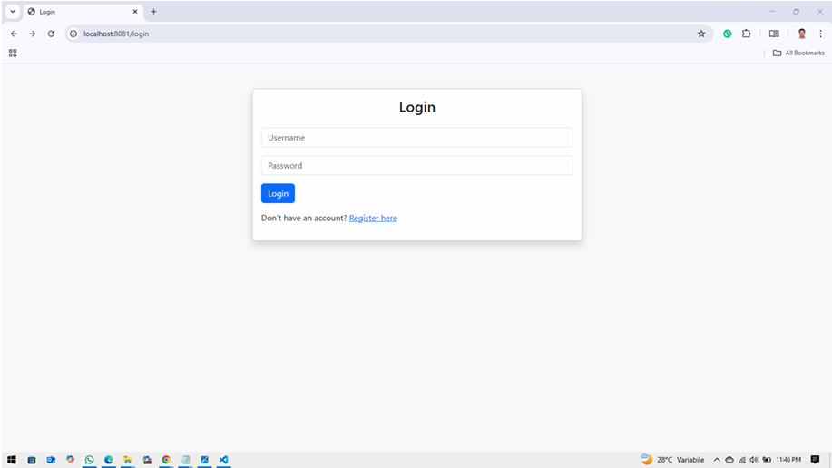
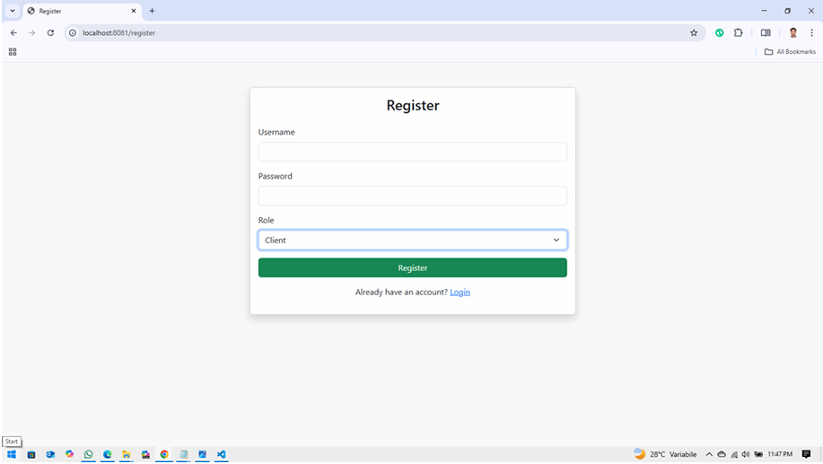
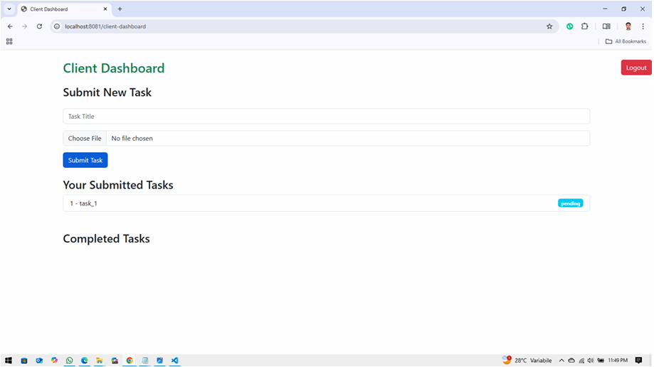
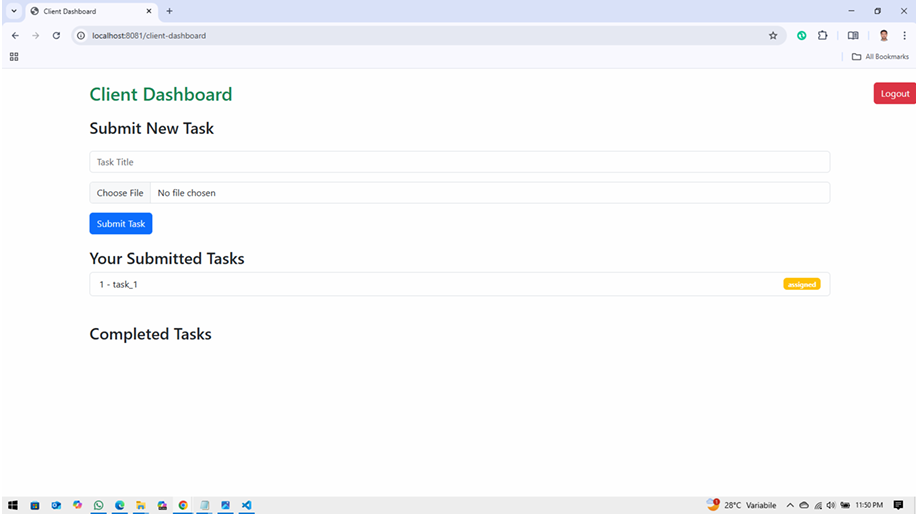
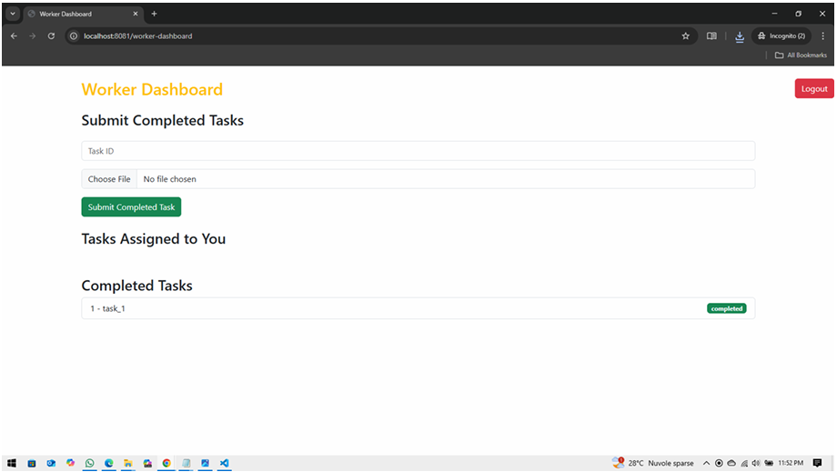
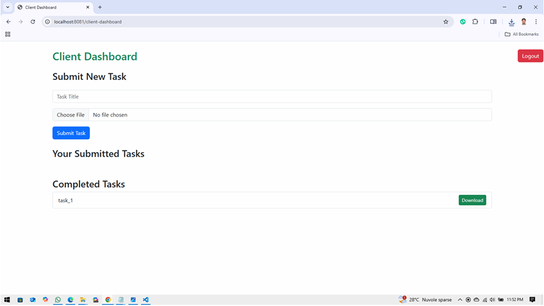

# Work Distributor System

**Submitted by:** Zakir Hussain
**Course:** Distributed Programming for Web, IoT and Mobile Systems  
**Instructor:** Prof. Galletta Letterio  
**Submitted on:** May 20, 2025

---

##  Introduction

This project, titled **Work Distributor System**, presents a real-time web application built using **Go (Golang)**. It enables dynamic assignment and tracking of tasks between clients and workers, simulating a task management workflow typically seen in software companies.

Key technologies include **WebSockets**, **Go routines**, and **Docker**, ensuring real-time updates, concurrency, and seamless deployment.

---

##  Problem Statement

Traditional task systems often suffer from static task distribution and poor user feedback. This project addresses those issues with:
- Real-time updates via WebSockets
- Automatic task distribution to the least-loaded worker
- Secure session and user-role management

---

##  System Overview

### Users:
- **Clients**: Submit tasks and receive real-time status updates
- **Workers**: Get tasks assigned, complete them, and upload results

### Key Features:
- WebSocket-based real-time updates
- Secure session-based login
- Intelligent task distribution logic
- SQLite for backend storage

---

## System Architecture

  
   
  <i>Figure: Real-Time Task Distribution Flow</i>

##  Implementation Details

###  Technology Stack
- **Backend**: Golang
- **Database**: SQLite
- **WebSocket**: Gorilla WebSocket
- **Session**: Gorilla Sessions
- **ORM**: GORM
- **Routing**: Gorilla Mux
- **Containerization**: Docker, Docker Compose

###  Backend Modules
- `Coordinator`: HTTP routes, login, registration
- `Distributor`: Goroutine assigning tasks based on load
- `Middleware`: Auth and role validation
- `Repository`: GORM-based DB operations
- `Session`: Session & cookie handling

###  Database Schema
- `Users`: username, password, role (client/worker)
- `Tasks`: ID, title, file paths, status, assignment info

###  Real-Time Communication
- WebSocket used for pushing messages when:
  - A task is assigned
  - A task is completed

---

##  Security Features

- Passwords hashed with bcrypt
- Sessions secured using `.env` secret
- Role-based access restrictions via middleware

---

##  Task Distribution Logic

- Periodically checks for unassigned tasks
- Assigns to the worker with the fewest current tasks
- Notifies both client and worker via WebSocket

---

##  User Experience

### Clients:
- Register/login
- Submit task with file
- View task status updates
- Download completed tasks

### Workers:
- Register/login
- Receive tasks live (no refresh)
- Upload completed work

---

##  Dockerization

Docker + Docker Compose used for deployment.  
- Base Image: `golang:1.23.2`
- Port exposed and binary executed inside container

---

##  Results and Testing

Manual testing confirmed:
- Task flow from submission to completion
- Real-time updates
- Session security and restricted access
- Error handling and validations

---

##  Conclusion

This project demonstrates:
- Real-time, secure task management using Go
- WebSocket and goroutine integration
- Scalable and dockerized distributed architecture

---

##  Future Scope

- Email notifications
- Task deadlines and alerts
- Multi-role worker support

---

##  References

- [Golang WebSocket Tutorial](https://medium.com/wisemonks/implementing-websockets-in-golang-d3e8e219733b)
- [Golang Tour](https://go.dev/tour/welcome/1)
- [Dockerizing Go](https://zohaibadnan137.medium.com/dockerizing-a-go-application-ee67516c590a)
- [Official Docker Guide for Go](https://docs.docker.com/guides/golang/build-images/)
